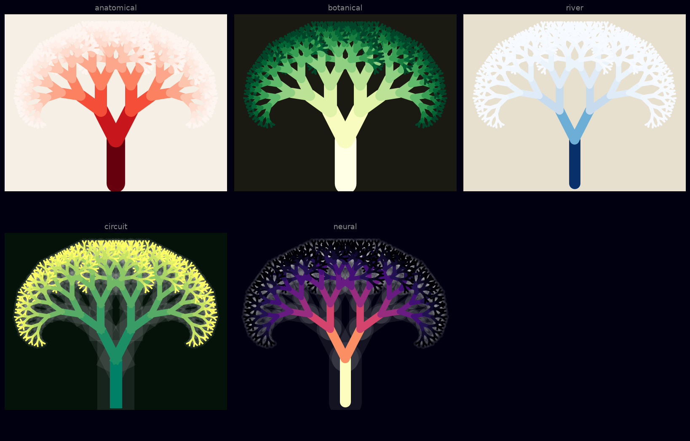
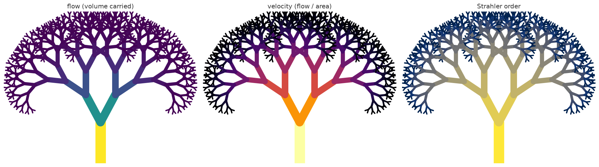

# vascular_branching

> Fractal vessels: the geometry of blood, rivers, and trees.

Generate and visualise **space-filling branching networks** — the shape shared
by blood vessels, river deltas, tree branches, lungs, and neurons. Three
generators (DLA, space colonization, recursive CSG) all emit one `Tree`, which
you then size with **Murray's law**, analyse for **flow**, and render in one of
five **visual styles**.

<p align="center">
  
</p>

## What This Is

Vascular systems — blood vessels, river deltas, tree branches — share a common
geometry: **space-filling branching fractals** that optimize transport. This
repo generates and visualizes these patterns, and models the physics that makes
them look the way they do.

## Install

```bash
git clone https://github.com/merrypranxter/vascular_branching
cd vascular_branching
pip install -e .            # add ".[dev]" for the test suite
```

Requires Python ≥ 3.9, NumPy, and Matplotlib.

## Quickstart

```python
import vascular as vb

# 1. grow a network
tree = vb.grow_csg(depth=10, branching_angle=26, length_ratio=0.77)

# 2. size it so it obeys Murray's law
vb.apply_murray(tree, leaf_radius=0.6, exponent=3.0)

# 3. assign conserved flow
vb.compute_flow(tree)

# 4. render
vb.save(tree, "tree.png", style="botanical")
```

<p align="center">
  
  
</p>

Or from the command line (installed as the `vascular` script):

```bash
vascular csg      --depth 10 --angle 26 --style botanical  -o tree.png
vascular dla      --particles 2000       --style neural     -o dla.png  --seed 42
vascular colonize --attractors 800       --style anatomical -o organ.png
```

## Key Models

### 1. Diffusion-Limited Aggregation (DLA) — `grow_dla`
Particles random-walk and stick where they touch. Creates wild, dendritic
fractal trees (fractal dimension ≈ 1.71 in 2D).

### 2. Constructive Solid Geometry (CSG) — `grow_csg`
Recursive splitting: each branch splits into 2+ smaller branches at fixed
angle and length ratios. The deterministic, self-similar baseline.

### 3. Murray's Law — `apply_murray`
Optimal branching: `r_parent³ = r_child₁³ + r_child₂³` (conserves flow with
minimal energy). Exponent is tunable for plant/river regimes.

### 4. Space Colonization — `grow_space_colonization`
Grow toward attractor points (leaves, tissue regions, a coastal plain). Fills a
region without overshooting — the go-to for venation and deltas.

The maths behind all four is written up in [`docs/THEORY.md`](docs/THEORY.md).

## Parameters

- `branching_angle` — angle between sibling branches
- `length_ratio` — child length / parent length
- `diameter_ratio` — governed by the Murray `exponent`
- `Murray exponent` — enforce the r^k law (3 = cube law)
- `attraction_points` — space colonization targets
- `vein_vs_artery` — oxygenated (red) vs deoxygenated (blue), via styles/flow

## Analysis

Once a tree is sized you can read it as a transport model:

```python
vb.velocities(tree)       # flow / area per node — fast trunk, slow capillaries
vb.strahler_order(tree)   # Horton–Strahler generation of each vessel
vb.murray_residual(tree)  # how well the law is satisfied (≈ 0 for our trees)
```

<p align="center">
  
</p>

## Visual Styles

One geometry, many readings — geometry and aesthetics are decoupled:

- **Anatomical** — realistic vascular networks (velocity-coloured reds)
- **Botanical** — tree branches, leaf venation (depth-coloured greens)
- **River delta** — meandering distributaries (flow-coloured blues)
- **Circuit board** — artificial, angular, glowing
- **Neural** — neurons, synaptic trees (magma, glow)

Define your own in a few lines — see [`examples/08_custom_style.py`](examples/08_custom_style.py).

## GPU / shaders

A real-time procedural version lives in [`shaders/vascular.frag`](shaders/vascular.frag)
— domain-warped noise carved into pulsing veins, Shadertoy-ready.

## Examples

Every script in [`examples/`](examples/) is runnable and writes into `gallery/`:

| Script | Shows |
|--------|-------|
| `01_csg_recursive.py`      | recursive branching + Murray sizing |
| `02_space_colonization.py` | filling a leaf-shaped region |
| `03_dla_cluster.py`        | stochastic DLA growth |
| `04_murray_law.py`         | how the Murray exponent reshapes a tree |
| `05_styles_gallery.py`     | one tree in all five styles |
| `06_flow_and_strahler.py`  | flow, velocity, Strahler analysis |
| `07_river_delta.py`        | a river delta via space colonization |
| `08_custom_style.py`       | defining your own style |

## Project layout

```
vascular/            the library
  core.py            Tree / Node — the shared data structure
  csg.py             recursive branching generator
  dla.py             diffusion-limited aggregation generator
  space_colonization.py   attractor-driven generator
  murray.py          Murray's-law diameter sizing
  flow.py            flow, velocity, Strahler order
  styles.py          visual style presets
  render.py          matplotlib rendering
  cli.py             the `vascular` command-line tool
examples/            runnable, self-documenting demos
shaders/             real-time GLSL counterpart
docs/THEORY.md       the maths, with references
tests/               pytest suite
```

## Tests

```bash
pip install -e ".[dev]"
pytest
```

## Related

- `dla_cluster` — same physics, different framing
- `mycelial_network` — fungal analog

## License

MIT — see [`LICENSE`](LICENSE).

---

*Every vascular system is a tree. Every tree is a vascular system. The geometry doesn't care what flows through it.*
